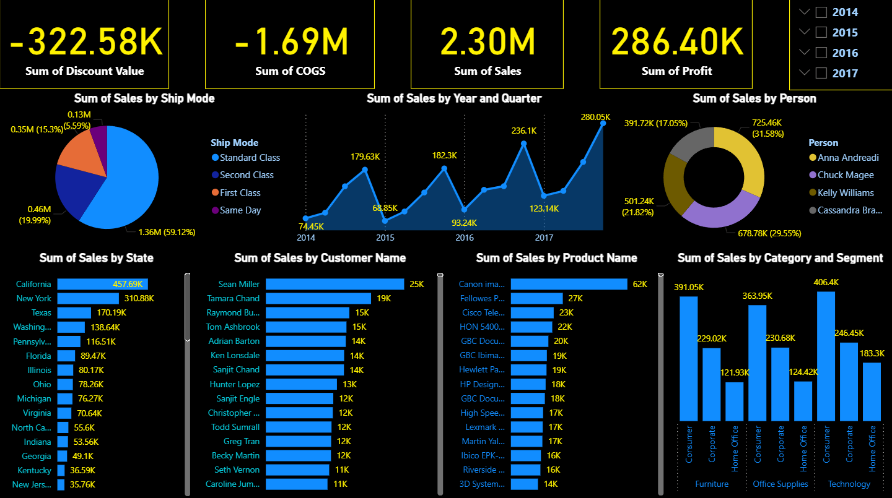

# 📊 Sales Performance Dashboard

## 🧩 Overview
This interactive Power BI dashboard provides a comprehensive view of company sales performance across multiple dimensions, including time, geography, product, and customer segmentation.  
It offers clear visual insights into key performance metrics such as total sales, profit, discount value, and cost of goods sold (COGS).

---

## 🚀 Key Metrics
| Metric | Value | Description |
|--------|--------|-------------|
| 💰 **Sum of Sales** | **2.30M** | Total revenue generated across all years. |
| 📈 **Sum of Profit** | **286.40K** | Net profit after deducting all costs. |
| 📦 **Sum of COGS** | **-1.69M** | Total cost of goods sold. |
| 🏷️ **Sum of Discount Value** | **-322.58K** | Total discount amount applied on sales. |

---

## 📅 Sales Trend by Year & Quarter
The dashboard highlights consistent sales growth from **2014 to 2017**, with notable peaks in:
- **2015 Q4** – 179.63K  
- **2017 Q4** – 280.05K (highest quarterly sales)

This trend indicates increasing customer engagement and improved sales strategy performance over time.

---

## 🧭 Sales by Geography
Top performing states:
1. **California – 457.69K**
2. **New York – 310.88K**
3. **Texas – 170.19K**

These states contribute the most to overall revenue, suggesting high-value markets with strong sales activity.

---

## 👥 Sales by Customer
Key customers with the highest purchase values:
- **Sean Miller – 25K**
- **Tamara Chand – 19K**
- **Raymond Buch – 15K**
  
Customer-level insights help identify loyal buyers and potential upselling opportunities.

---

## 🛒 Sales by Product
Top-selling products include:
- **Canon imageCLASS – 62K**
- **Fellowes PB500 – 27K**
- **Cisco TelePresence – 23K**

These high-performing items significantly drive company revenue and should be prioritized in inventory and marketing strategies.

---

## 🚚 Sales by Ship Mode
| Ship Mode | Sales Value | Share |
|------------|--------------|--------|
| Standard Class | 1.36M | 59.12% |
| Second Class | 0.46M | 19.99% |
| First Class | 0.35M | 15.33% |
| Same Day | 0.13M | 5.59% |

**Standard Class** is the dominant delivery method, emphasizing its reliability and cost efficiency.

---

## 🧑‍💼 Sales by Person
| Salesperson | Sales Value | Percentage |
|--------------|--------------|-------------|
| Anna Andreadi | 725.46K | 31.58% |
| Kelly Williams | 678.78K | 29.55% |
| Cassandra Brand | 501.24K | 21.82% |
| Chuck Magee | 391.72K | 17.05% |

Anna Andreadi leads sales performance, accounting for nearly one-third of total sales.

---

## 🗂️ Sales by Category and Segment
| Category | Segment | Sales |
|-----------|----------|-------|
| Furniture | Consumer | 391.05K |
| Furniture | Corporate | 229.02K |
| Office Supplies | Consumer | 363.95K |
| Office Supplies | Corporate | 230.68K |
| Technology | Corporate | 406.4K |

**Technology** products generate the highest sales, especially within the **Corporate** segment.

---

## 🛠️ Tools & Technologies
- **Power BI** – Data visualization and dashboard design  
- **Excel / CSV** – Data source and preprocessing  
- **GitHub** – Version control and collaboration platform  

---

## 📸 Dashboard Preview

---

## 🧠 Insights Summary
- Sales steadily increased from 2014 to 2017.  
- Standard Class shipping dominates due to its balance between cost and reliability.  
- California is the top-performing state by revenue.  
- Technology and Office Supplies lead in category sales.  
- Anna Andreadi consistently drives the most sales among representatives.

---

## 📎 Author
**Ibrahim Nady**  
Data Analyst | Power BI Developer  
📧 [ibrahimnady.abdelrahman@gmail.com]  
🌐 [www.linkedin.com/in/ibrahim-nady-466b931b6]
